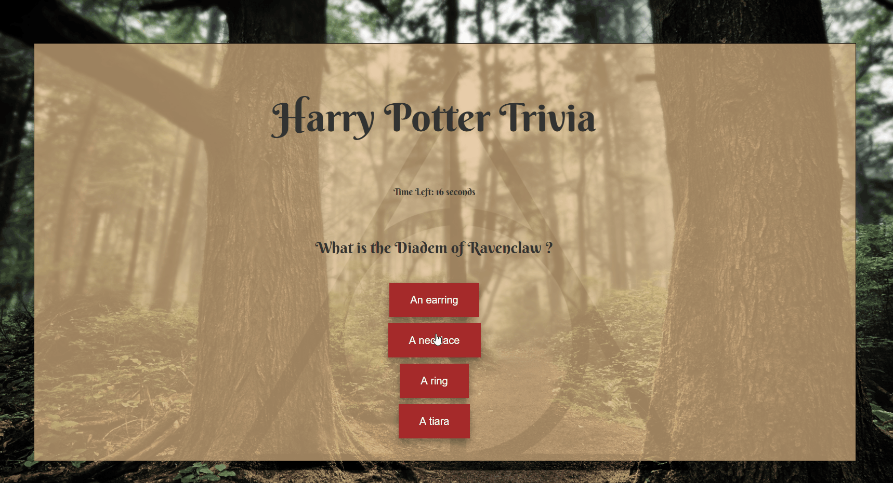
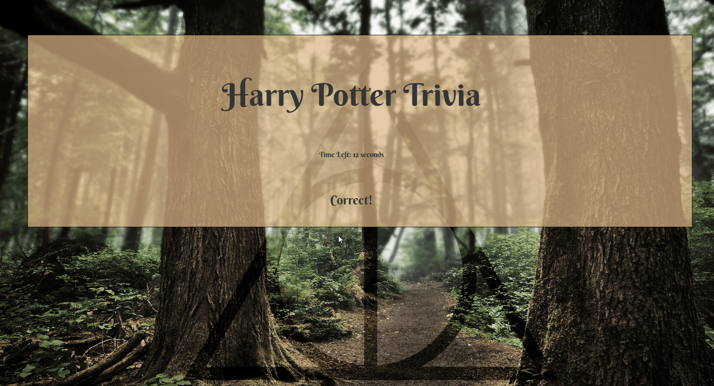

# Trivia Game

#### This app uses jquery and setTimeOut to deliver a timed quiz. Quiz questions are ordered in an array of objects which are looped through and delivered on the main content div.

### Correct Answers

#### When a question is answered correctly, the window changes and a point is added to your score

### Incorrect Answers

#### When a question is answered incorrectly, the app will inform you that you are incorrect and give you the correct answer. No points are added to your score.

#### If the question isn't answered in the duration of the SetTimeOut, the question is counted as an incorrect answer.

### Game Over and Reset

#### When you have passed through all questions, you are informed of your final score. After a setTimeOut of 10 seconds, the game will begin again. You can bypass the setTimeOut by clicking the reset button.

